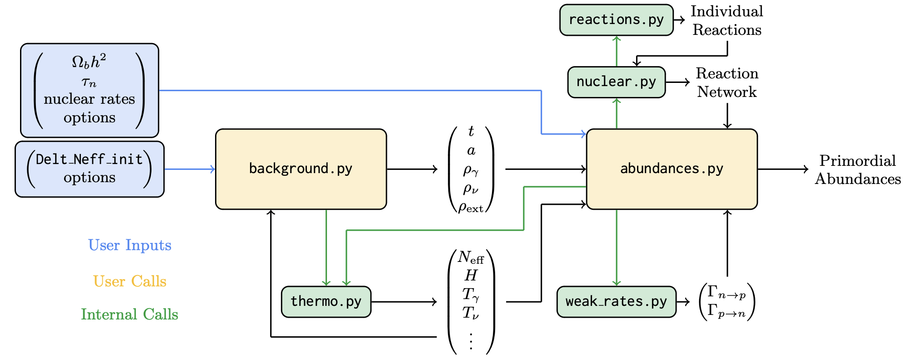

.. LINX documentation master file, created by
   sphinx-quickstart on Wed Aug 21 16:46:41 2024.
   You can adapt this file completely to your liking, but it should at least
   contain the root `toctree` directive.

LINX
====

**LINX** (Light Isotope Nucleosynthesis with JAX) is a fast, extensible, differentiable numerical code for predicting primordial element abundances during Big Bang Nucleosynthesis.

Installation
------------
To download and install LINX, please visit our `GitHub <https://github.com/cgiovanetti/LINX>`_.  There you will find detailed instructions for installing LINX and its dependencies.

Module Structure
----------------
The high-level organization of LINX is as follows:

In most cases, the user will only need to call **background.BackgroundModel** and **abundances.AbundanceModel** explicitly; the other modules will be called by these two top-level modules.

Examples
--------
Seven pedagogical examples demonstrating how to use LINX are available at our `GitHub <https://github.com/cgiovanetti/LINX>`_.  These include Jupyter notebooks demonstrating

- `How to use the thermodynamics modules <https://github.com/cgiovanetti/LINX/blob/main/example_notebooks/background_evolution.ipynb>`_
- `How to calculate abundances and include BBN uncertainties <https://github.com/cgiovanetti/LINX/blob/main/example_notebooks/Schramm.ipynb>`_
- `How to toggle options in the weak rates module <https://github.com/cgiovanetti/LINX/blob/main/example_notebooks/weak_rates.ipynb>`_
- `How to view the evolution of primordial abundances with time <https://github.com/cgiovanetti/LINX/blob/main/example_notebooks/nuclear_evolution.ipynb>`_
- `How to isolate the impact of BBN uncertainties on final predictions <https://github.com/cgiovanetti/LINX/blob/main/example_notebooks/NuisanceParametersImpact.ipynb>`_
- `How to perform one-parameter inference with LINX <https://github.com/cgiovanetti/LINX/blob/main/example_notebooks/inference_Omega_b.ipynb>`_
- `How to perform two-parameter inference with LINX <https://github.com/cgiovanetti/LINX/blob/main/example_notebooks/scan_over_Omega_b_tau_n.ipynb>`_

Documentation
-------------
.. toctree::
   :maxdepth: 2

   abundances
   background
   nuclear
   reactions
   special_funcs
   thermo
   weak_rates
